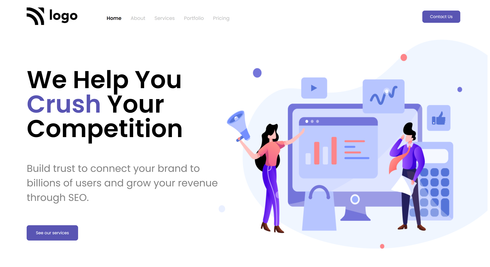

# This project Built With
#### 1.HTML
#### 2.CSS

## Acknowledgements
This  digital marketing landing Page project,  took me almost 5 hrs to complete,this is my first project in fullstack development course by ineuron.in.

### During this project I've learned:

1.How to make navigation bar and hero section.
2.How layout webpage.
3.How to make two divs close to each other.
4.How to postion element using CSS position properties.

## Here is screen shot of project4.

## Here is live link
[Live link](https://rohini-project04.netlify.app/)